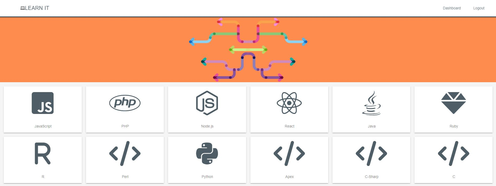
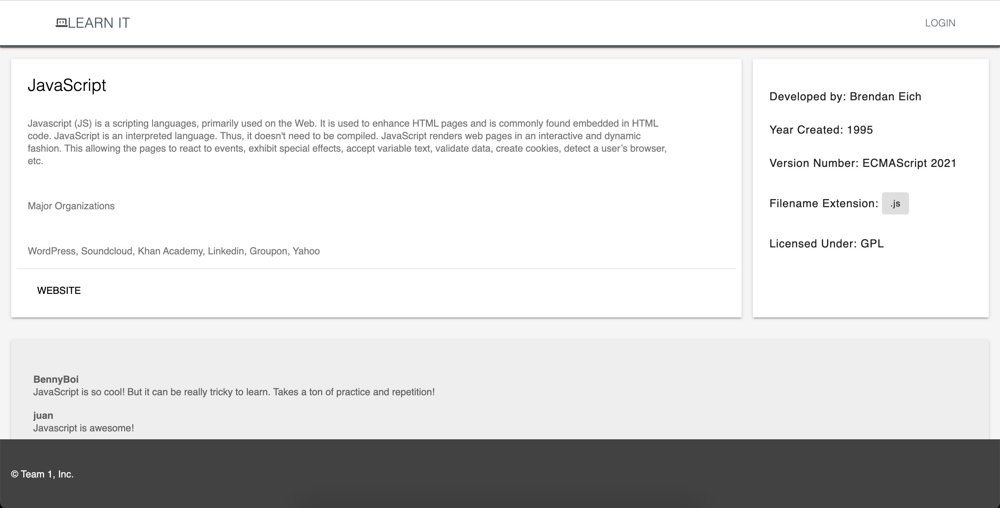
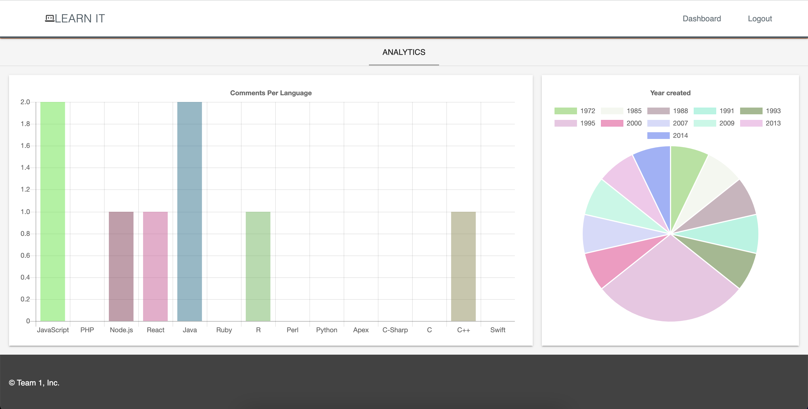

# LEARN IT

## Description
An interactive educational forum for exploring web development languages! A great site for anyone interested in coding and learning what languages are available. Choose a language to view more about the history and background and see what people are saying about it. Create an account to join the conversation and share personal anecdotes and online resources, view comment analytics, and engage with the larger LEARN IT community! Contact the site administrators to become an Admin.  Admin privileges include adding new languages, editing & removing current ones, and designating other users as Admins.

## **Table of Contents**
* [Screenshots](#screenshots)
* [Programs](#programs)
* [Website](#website)
* [Contribution](#contribution)

## **Screenshots**

## **Programs**
* bcrypt
* chart.js
* connect-session-sequelize
* CSS
* dotenv package
* express
* express-handlebars
* express-session
* Heroku
* JavaScript
* MySQL2 package
* Node.js
* Sequelize

## **Website**
[LEARN IT](https://damp-journey-96412.herokuapp.com/)

## **Contribution**
Please contact the team directly with any additional questions regarding this project:
* Chris Angalet - https://github.com/cangalet
* Juan Chavez - https://github.com/realchavezjuan
* Chris Lawn - https://github.com/ChristopherLawn
* David Manriquez - https://github.com/DMAN28

# ©️ 2022